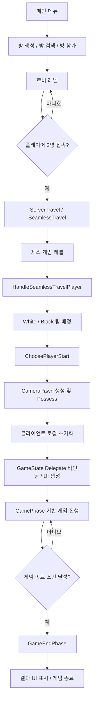

# Battle Chess
> Unreal Engine 5와 RPC·Replication·OnRep을 활용한 멀티 체스 배틀 게임

<p align="center">
 
</p>

## 프로젝트 소개

**Battle Chess**은 체스의 턴제 보드 이동과 실시간 캐릭터 전투를 결합한 2인 온라인 멀티플레이 게임입니다.

Listen Server 기반으로 제작되었으며, Steam Sessetion을 통해 접속할 수 있습니다.

플레이어는 체스판에서 말을 이동시키고, 상대 말을 잡는 상황이 발생하면 별도의 전투 단계로 전환됩니다. 

전투 단계에서는 각 플레이어가 자신의 체스말 Pawn을 조작하여 실시간으로 전투를 진행하며, 전투 결과에 따라 보드 상태가 갱신됩니다.

## 개발 정보

| 항목 | 내용 |
|---|---|
| 개발 인원 | 1인 |
| 개발 기간 | 2026.05.01 ~ 2026.06.01 |
| 엔진 | Unreal Engine 5.7 |
| 언어 | C++ / Blueprint |
| 장르 | 2인 멀티 플레이 체스 배틀 |
| 개발 환경 | Visual Studio 2022 |
| 영상 | [Battle Chess 게임 플레이 영상](https://www.youtube.com/watch?v=tC9wKRi5SUg)|

## 다운로드
[Battle Chess 다운로드](https://drive.google.com/drive/folders/1pbk6wzJjnAD-M2_Ry3bJffAeC9SU87Ec?usp=drive_link)

## 기술 스택

- Unreal Engine 5.7
- C++
- Blueprint
- Listen Server
- Replication
- RPC
- Seamless Travel
- Enhanced Input
- Animation Montage / AnimNotifyState
- UI / UMG
- DataAsset

## 핵심 목표
- **서버 권위 기반 멀티플레이 구조**
  <br>
  클라이언트가 직접 게임의 상태를 변경하지 않고, 서버가 클라이언트의 요구를 판단, 검증하여 안정적인 멀티 시스템을 설계했습니다.
<br>

- **상태 기반 게임 진행 시스템**
  <br>
  체스 이동, 베팅, 전투, 전투 종료, 게임 종료 단계를 Enum으로 구분하여 UI와 입력 상태가 안정적으로 전환되도록 설계했습니다
<br>

- **데이터 기반 체스말 관리**
  <br>
   체스말의 스탯과 전투 데이터를 코드가 아닌 데이터 에셋으로 분리하여, 추후 밸런스 조정과 말 추가가 쉽도록 구성했습니다.
<br>

- **턴제 보드 이동과 실시간 전투의 결합**
  <br>
  체스의 전략적인 이동 흐름과 캐릭터 조작 기반 전투를 하나의 게임 흐름으로 연결하고자 했습니다.
<br>
  
- **반복 테스트를 위한 디버그 기능**
  <br>
  게임 페이즈 변경, 전투 상황 설정, 시간 조정 등을 빠르게 테스트할 수 있는 개발용 디버그 UI를 구현했습니다.
<br>

 ## 게임 진행 흐름 다이어그램 
<details>
<summary>펴기</summary>



</details>

# 핵심 구현
## 1. 서버 권위형 GameMode 구조
게임의 핵심 진행은 서버의 GameMode에서만 처리하도록 구성했습니다.
- 게임 페이즈 전환
- 턴 변경
- 체스말 이동 검증
- 전투 시작 및 종료
- 승패 판정
- Possess 처리

### 1)  Client -> Server 요청 흐름

클라이언트는 게임 상태를 직접 변경하지 않고, 서버 RPC를 통해 요청만 보냅니다.  
서버는 요청이 유효한지 검증한 뒤 `GameState`를 갱신하고, 변경된 상태는 Replication을 통해 각 클라이언트에 동기화됩니다.

| 구분 | 함수 | 역할 |
|---|---|---|
| 게임 준비 | `Server_Ready()` | 클라이언트가 게임 준비 완료 상태를 서버에 알림 |
| 체스말 선택 | `Server_SelectPiece()` | 선택한 체스말이 현재 플레이어의 말인지 서버에서 확인 |
| 체스말 이동 | `Server_RequestMovePiece()` | 이동 가능한 위치인지 검증 후 보드 상태 갱신 |
| 전투 진입 | `Server_RequestBattle()` | 공격자와 방어자를 검증하고 전투 페이즈로 전환 |
| 전투 입력 | `Server_Attack()` | 전투 중 공격 요청을 서버에서 처리 |
| 전투 종료 | `Server_EndBattle()` | 전투 결과에 따라 체스말 제거 및 보드 상태 갱신 |
| 디버그 | `Server_DebugChangePhase()` | 개발용으로 게임 페이즈를 강제 변경 |

### 2)  개발용 Debug RPC

반복 테스트를 위해 일부 디버그 기능도 Server RPC로 구성했습니다.  
게임 페이즈 변경, 전투 상황 설정, 시간 조정 기능을 서버에서 처리하도록 하여 멀티플레이 환경에서도 양쪽 클라이언트가 같은 상태를 확인할 수 있도록 했습니다.
<br><br>

## 2. GamePhase 기반 게임 진행 시스템
체스 단계, 베팅 단계, 전투 단계처럼 서로 다른 입력 방식과 UI가 필요한 구간을 하나의 상태값으로 관리하기 위해 EGamePhase enum을 정의했습니다.

```
UENUM(BlueprintType)
enum class EGamePhase : uint8
{
    InitGamePhase,
    PreGamePhase,
    ChessPhase,
    BettingPhase,
    PreBattlePhase,
    BattlePhase,
    EndBattlePhase,
    FinishBattlePhase,
    GameEndPhase
};
```
각 클라이언트의 PlayerController는 변경된 페이즈를 기준으로 UI 표시, 입력 활성화 여부, 타이머, Possess 대상을 갱신합니다.
<br><br>

## 3. DataAsset 기반 체스 말 데이터 관리

체스 말의 타입, 전투 스탯, Mesh, 공격 / 사망 Montage를 코드에 직접 고정하지 않고 `DataAsset`으로 분리했습니다.

관리 대상 예시는 다음과 같습니다.

- Piece Type
- Team
- Battle Stat
- Max HP
- Mesh
- Attack Montage
- Death Montage
<br><br>

## 4. Steam Session 기반 멀티플레이
Listen Server 기반 멀티플레이 접속을 위해 Steam Session 흐름을 구현했습니다.

- Host / Find / Join Session 플로우 구현
- Steam OnlineSubsystem 설정
- SteamSockets 기반 NetDriver 설정
- 로비 레벨에서 두 명의 플레이어가 접속하면 게임 레벨로 이동
- 패키징 환경에서 다른 PC 간 접속 테스트 진행
<br><br>

## 5. Runtime Debug UI
개발 중 특정 게임 페이즈와 전투 상황을 빠르게 검증하기 위해 Runtime Debug UI를 제작했습니다.

디버그 UI 기능은 다음과 같습니다.

- `BettingPhase` 강제 진입
- `BattlePhase` 강제 진입
- Attacker / Defender 지정
- 전투 시간 수정
- `EndBattlePhase` 결과 강제 적용
- `GameEndPhase` 결과 강제 적용

디버그 기능은 실제 게임 로직을 오염시키지 않도록 다음 흐름으로 구성했습니다.

```
Debug Widget
-> PlayerController Server RPC
-> GameMode Debug Function
-> GameState Phase 변경
-> Client UI 동기화
```
또한 Shipping 빌드에는 포함되지 않도록 `#if !UE_BUILD_SHIPPING` 조건을 사용해 개발용 기능과 실제 게임 기능을 분리했습니다.
<br><br>

## 6. 추가적인 부분
- 현재 게임은 Listen Server로 동작하지만, Dedicate Server 또한 대응이 가능하게 개발이 되어있습니다.
- seamless Traval을 통한 로비에서 인 게임으로 끓김 없는 플레이가 가능합니다.

# 주요 트러블 슈팅

## 문제 1. SeamlessTravel 이후 Host와 Client의 초기화 타이밍 차이

### 문제 상황

로비에서 게임 맵으로 이동한 뒤, Host와 Client의 `PlayerController` 초기화 타이밍이 달랐습니다.

특히 Host는 SeamlessTravel 이후 `BeginPlay`가 다시 호출되지 않는 상황이 있었고, Client는 새 월드에서 로컬 초기화가 다른 타이밍에 동작했습니다. 이로 인해 `GameState Delegate` 바인딩, UI 생성, Ready 호출 타이밍이 불안정했습니다.

### 원인 분석

Unreal의 멀티플레이 접속 흐름을 로그로 추적했습니다.

- `PreLogin`
- `PostLogin`
- `HandleSeamlessTravelPlayer`
- `HandleStartingNewPlayer`
- `RestartPlayer`
- `ChoosePlayerStart`
- `PawnClientRestart`

그 결과, 서버에서 처리해야 하는 초기화와 클라이언트 로컬에서 처리해야 하는 초기화를 분리해야 한다는 것을 확인했습니다.

### 해결 방법

- 팀 배정과 Pawn 생성은 서버 `GameMode`에서 처리
- UI, GameState 바인딩, Ready 호출은 소유 클라이언트에서 처리
- `PlayerController`의 Client RPC를 사용해 SeamlessTravel 이후 로컬 초기화 진입점 구성
- GameState가 이미 존재하는 경우 즉시 바인딩하고, 아직 없는 경우 `GameStateSetEvent`를 통해 대기

### 배운 점

Unreal 멀티플레이에서는 Actor가 존재하는 위치와 실행 주체를 명확히 구분해야 합니다.

`GameMode`는 서버에만 존재하고, `PlayerController`는 서버와 소유 클라이언트에만 존재하며, `GameState`는 서버와 모든 클라이언트에 복제됩니다. 이 차이를 기준으로 초기화 책임을 나누는 것이 중요하다는 것을 배웠습니다.

---

## 문제 2. Pawn 전환 후 Client 입력이 다시 동작하지 않는 문제

### 문제 상황

`CameraPawn`에서 `PiecePawn`으로 Possess한 뒤 다시 `CameraPawn`으로 돌아왔을 때, Host는 입력이 정상적으로 다시 바인딩되었지만 Client에서는 입력이 동작하지 않는 문제가 발생했습니다.

### 원인 분석

Possess는 서버에서 발생하지만, 실제 입력 바인딩은 소유 클라이언트의 로컬 Pawn / InputComponent에서 준비되어야 합니다.

단순히 Possess만 처리하면 클라이언트에서 Pawn의 입력 설정 타이밍이 맞지 않을 수 있었습니다.

### 해결 방법

- Pawn이 자신의 입력 바인딩을 책임지도록 구조 유지
- `PawnClientRestart` 시점에서 소유 클라이언트의 입력 재설정 처리
- Controller에 모든 입력을 넣지 않고, Pawn별 입력 로직을 분리

그 결과 전투 진입 시에는 `PiecePawn` 입력이 활성화되고, 전투 종료 후 `CameraPawn`으로 돌아왔을 때 체스판 이동 및 선택 입력이 다시 정상적으로 동작하도록 개선했습니다.

### 배운 점

멀티플레이에서 Possess는 단순히 Controller와 Pawn을 연결하는 것만이 아니라, 클라이언트의 Camera, Input, UI 상태까지 함께 고려해야 하는 흐름이라는 것을 이해했습니다.


